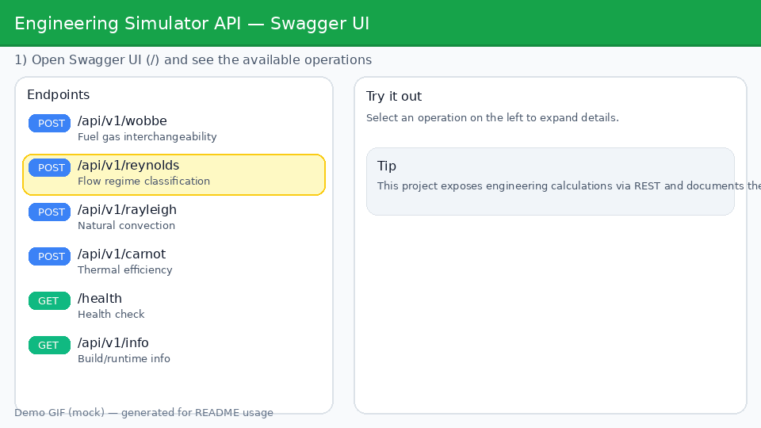

# Engineering Simulator API


## Quick UI Tour



A professional REST API for engineering calculations and simulations — dimensionless numbers (Reynolds, Rayleigh, Wobbe) and thermodynamic cycle efficiency (Carnot). Built with .NET 8, Clean Architecture, and rigorous scientific validation.

---

## Architecture

```
┌──────────────────────────────────────────────────┐
│                    API Layer                      │
│  Controllers · Middleware · Swagger · DI Config   │
├──────────────────────────────────────────────────┤
│               Application Layer                   │
│  Services · DTOs · FluentValidation Validators    │
├──────────────────────────────────────────────────┤
│              Infrastructure Layer                  │
│  Serilog · Correlation ID · Config Adapters       │
├──────────────────────────────────────────────────┤
│                 Domain Layer                       │
│  Pure Calculations · Domain Exceptions            │
│  (zero framework dependencies)                    │
└──────────────────────────────────────────────────┘
```

**Dependency rule**: each layer depends only on the layer directly below it. The Domain layer has no external dependencies — all calculations are pure, deterministic functions with no I/O, no DI, and no logging.

---

## Calculation Modules

### 1. Wobbe Index

The Wobbe Index measures fuel gas interchangeability. Two gases with the same Wobbe Index will deliver the same thermal input to a burner at the same supply pressure.

**Formula**: `W = PCS / √d`

Where PCS is the Higher Heating Value and d is the relative density (gas/air).

### 2. Reynolds Number

The Reynolds Number predicts flow regime in fluid mechanics — whether flow is laminar (smooth), transitional, or turbulent (chaotic).

**Formula**: `Re = (ρ · V · D) / μ`

| Range         | Regime      |
|---------------|-------------|
| Re < 2300     | Laminar     |
| 2300 ≤ Re < 4000 | Transition |
| Re ≥ 4000    | Turbulent   |

### 3. Rayleigh Number

The Rayleigh Number characterizes buoyancy-driven (natural) convection. It combines the effects of thermal buoyancy and viscous/thermal diffusion.

**Formula**: `Ra = (g · β · ΔT · L³) / (ν · α)`

Below Ra ≈ 1708, conduction dominates. Above Ra ≈ 10⁹, convection becomes turbulent.

### 4. Carnot Cycle Efficiency

The Carnot efficiency is the theoretical maximum efficiency for any heat engine operating between two thermal reservoirs.

**Formula**: `η = 1 − (Tc / Th)`

Result is a fraction in [0, 1), also returned as percentage.

---

## Expected Units

| Parameter          | Symbol | Unit     | Endpoint     |
|--------------------|--------|----------|--------------|
| Higher Heating Value | PCS  | MJ/m³   | Wobbe        |
| Relative density   | d      | —        | Wobbe        |
| Fluid density      | ρ      | kg/m³    | Reynolds     |
| Velocity           | V      | m/s      | Reynolds     |
| Diameter           | D      | m        | Reynolds     |
| Dynamic viscosity  | μ      | Pa·s     | Reynolds     |
| Gravity            | g      | m/s²     | Rayleigh     |
| Thermal expansion  | β      | 1/K      | Rayleigh     |
| Temp difference    | ΔT     | K        | Rayleigh     |
| Char. length       | L      | m        | Rayleigh     |
| Kinematic viscosity| ν      | m²/s     | Rayleigh     |
| Thermal diffusivity| α      | m²/s     | Rayleigh     |
| Hot temperature    | Th     | K        | Carnot       |
| Cold temperature   | Tc     | K        | Carnot       |

---

## Endpoints

| Method | Path               | Description                    |
|--------|--------------------|--------------------------------|
| POST   | `/api/v1/wobbe`    | Wobbe Index calculation        |
| POST   | `/api/v1/reynolds` | Reynolds Number calculation    |
| POST   | `/api/v1/rayleigh` | Rayleigh Number calculation    |
| POST   | `/api/v1/carnot`   | Carnot efficiency calculation  |
| GET    | `/health`          | Health check                   |
| GET    | `/api/v1/info`     | Build version and runtime info |

---

## Running Locally

### With .NET SDK

```bash
# Restore and build
dotnet restore
dotnet build

# Run the API
dotnet run --project src/EngineeringSimulator.API

# API available at http://localhost:5000
# Swagger UI at http://localhost:5000/
```

### With Docker

```bash
docker compose up --build

# API available at http://localhost:8080
# Swagger UI at http://localhost:8080/
```

---

## Example Requests

### Wobbe Index

```bash
curl -X POST http://localhost:8080/api/v1/wobbe \
  -H "Content-Type: application/json" \
  -d '{"pcs": 39.0, "relativeDensity": 0.60}'
```

### Reynolds Number

```bash
curl -X POST http://localhost:8080/api/v1/reynolds \
  -H "Content-Type: application/json" \
  -d '{"rho": 998, "velocity": 1.5, "diameter": 0.05, "mu": 0.001}'
```

### Rayleigh Number

```bash
curl -X POST http://localhost:8080/api/v1/rayleigh \
  -H "Content-Type: application/json" \
  -d '{"g": 9.81, "beta": 0.00341, "deltaT": 20, "l": 0.1, "nu": 1.56e-5, "alpha": 2.21e-5}'
```

### Carnot Efficiency

```bash
curl -X POST http://localhost:8080/api/v1/carnot \
  -H "Content-Type: application/json" \
  -d '{"th": 500, "tc": 300}'
```

### Health Check

```bash
curl http://localhost:8080/health
```

### Example Response (Reynolds)

```json
{
  "result": 74850.0,
  "unit": "-",
  "classification": "Turbulent",
  "notes": "Turbulent flow — inertial forces dominate, chaotic eddies present.",
  "inputEcho": {
    "rho": 998,
    "velocity": 1.5,
    "diameter": 0.05,
    "mu": 0.001
  }
}
```

---

## Running Tests

```bash
# All tests
dotnet test

# With coverage
dotnet test --collect:"XPlat Code Coverage"

# Domain unit tests only
dotnet test tests/EngineeringSimulator.Domain.Tests

# Integration tests only
dotnet test tests/EngineeringSimulator.API.Tests
```

---

## Project Structure

```
engineering-simulator-api/
├── src/
│   ├── EngineeringSimulator.Domain/          # Pure calculations, zero dependencies
│   │   ├── Calculations/
│   │   │   ├── WobbeCalculator.cs
│   │   │   ├── ReynoldsCalculator.cs
│   │   │   ├── RayleighCalculator.cs
│   │   │   └── CarnotCalculator.cs
│   │   └── Exceptions/
│   │       └── DomainValidationException.cs
│   ├── EngineeringSimulator.Application/     # Use cases, DTOs, validation
│   │   ├── DTOs/
│   │   ├── Services/
│   │   └── Validators/
│   ├── EngineeringSimulator.Infrastructure/  # Logging, adapters
│   │   └── Logging/
│   └── EngineeringSimulator.API/             # Controllers, middleware, DI
│       ├── Controllers/
│       └── Middleware/
├── tests/
│   ├── EngineeringSimulator.Domain.Tests/    # Unit tests for formulas
│   └── EngineeringSimulator.API.Tests/       # Integration tests (WebApplicationFactory)
├── Dockerfile
├── docker-compose.yml
├── .github/workflows/ci.yml
└── EngineeringSimulator.sln
```

---

## Contributing

1. Fork the repository
2. Create a feature branch (`git checkout -b feature/new-calculation`)
3. Write tests for any new calculations
4. Ensure all tests pass (`dotnet test`)
5. Submit a pull request

---

## License

[MIT](LICENSE)


